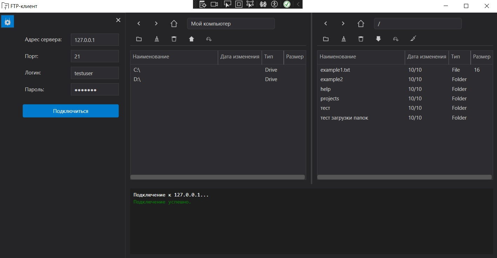

# WPF FTP Client

FTP-клиент для Windows, разработанный на платформе .NET 8 с использованием Windows Presentation Foundation (WPF) и архитектурным паттерном MVVM.

## Внешний вид и функционал

Приложение представляет собой классический двухпанельный файловый менеджер с интуитивно понятным интерфейсом для работы с локальными и удаленными файлами.

**Ключевые элементы интерфейса:**

*   **Панель подключения (слева)**: Здесь вводятся данные для подключения к FTP-серверу (адрес, порт, логин и пароль).
*   **Панель локальных файлов (в центре)**: Отображает файловую систему вашего компьютера.
*   **Панель удаленных файлов (справа)**: После успешного подключения здесь отображаются файлы и папки на FTP-сервере.
*   **Панели инструментов**: Над каждой файловой панелью расположены кнопки для навигации (`<`, `>`, `↑`) и управления файлами (создать папку, переименовать, удалить, скачать/загрузить).
*   **Панель логов (внизу)**: Отображает статус подключения и все команды, отправленные на сервер, а также его ответы.

## Архитектура и дизайн

Приложение построено на основе архитектурного паттерна **MVVM (Model-View-ViewModel)**.

*   **Model**: Представляет данные приложения (`FileItem.cs`).
*   **View**: Определяет структуру и внешний вид пользовательского интерфейса (XAML-файлы в папке `Views`). Представления максимально "пассивны" и только отображают данные из ViewModel.
*   **ViewModel**: Содержит логику представления и состояние UI. Управляет данными и командами, на которые реагирует View (`MainViewModel.cs`, `FilePanelViewModel.cs`).

Ключевые архитектурные решения:

*   **Dependency Injection (Внедрение зависимостей)**: Логика вынесена в сервисы с интерфейсами (`IFtpService`, `ILoggerService`), что делает код модульным, слабосвязанным.
*   **Service Layer (Слой сервисов)**: Вся работа с файловой системой, FTP-протоколом и диалоговыми окнами инкапсулирована в отдельных сервисах.
*   **Commands**: Взаимодействие с пользователем реализовано через команды (`RelayCommand`), что отвязывает логику от конкретных элементов управления.

## Технологический стек

*   **Платформа**: .NET 8
*   **UI Framework**: WPF (Windows Presentation Foundation)
*   **Архитектурный паттерн**: MVVM
*   **Язык**: C#

## Структура проекта

*   `Commands`: Реализация паттерна "Команда" (например, `RelayCommand`) для обработки действий пользователя.
*   `Converters`: Конвертеры данных для WPF-биндингов.
*   `Enums`: Перечисления, определяющие типы и состояния в приложении.
*   `Helpers`: Вспомогательные классы и утилиты.
*   `Models`: Классы, описывающие сущности данных (файл, сообщение лога).
*   `Resources`: Ресурсы приложения, включая стили (`.xaml`) и кастомные элементы управления (`Controls`).
*   `Services`: Сервисы, инкапсулирующие бизнес-логику (работа с FTP, файлами, логгером).
*   `ViewModels`: ViewModel-классы, управляющие логикой и состоянием UI.
*   `Views`: XAML-представления (окна и пользовательские элементы управления).

## Как запустить проект

### Требования

*   [.NET 8 SDK](https://dotnet.microsoft.com/en-us/download/dotnet/8.0)
*   [Visual Studio 2022](https://visualstudio.microsoft.com/ru/vs/) с установленной рабочей нагрузкой ".NET Desktop Development".

### Инструкция по запуску

1.  **Клонируйте репозиторий.**

2.  **Откройте проект в Visual Studio:**
    Откройте файл `FTP_Client.sln` (или `FTP_Client.csproj`) в Visual Studio 2022.

3.  **Соберите проект:**
    Нажмите `Ctrl+Shift+B` или выберите в меню `Build -> Build Solution`. Все необходимые зависимости будут восстановлены автоматически.

4.  **Запустите приложение:**
    Нажмите `F5` или кнопку "Start" на панели инструментов для запуска приложения в режиме отладки.

    ## Планы по развитию (TODO)

Проект является завершенным в рамках учебного задания, но имеет потенциал для дальнейшего развития. Ниже перечислены возможные улучшения и новые функции:

### Ключевые функции
- [ ] Поддержка безопасных протоколов **SFTP** и **FTPS**.
- [ ] Реализация очереди для фоновой загрузки и скачивания файлов.
- [ ] Добавление менеджера для сохранения профилей подключения.
- [ ] Функция синхронизации каталогов.

### Улучшения интерфейса
- [ ] Поддержка перетаскивания файлов (Drag-and-Drop) между панелями.
- [ ] Добавление светлой темы оформления.

